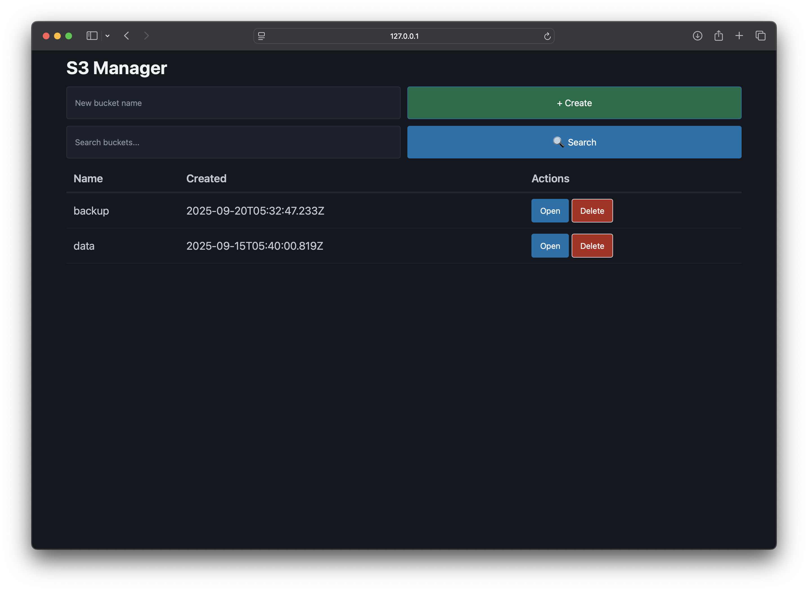
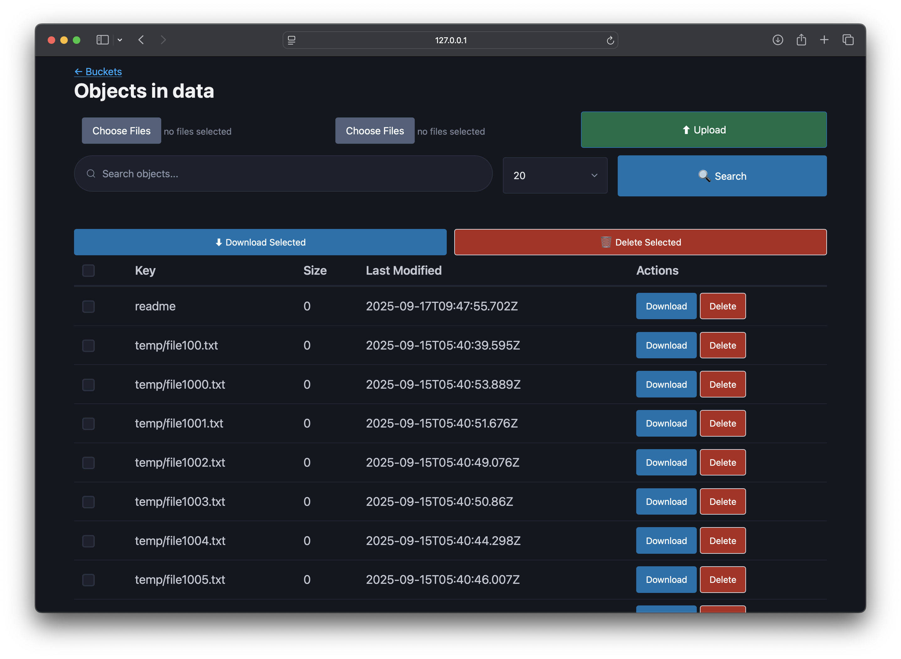

# S3 Manager

Backend and Web GUI for managing S3 compatible buckets.  
This was initially a [fork](https://github.com/cloudlena/s3manager), but things
have diverged so much that currently the only thing these two have in common, is
their names.

|  Buckets |  Objects |
|----------------------------------------------|----------------------------------------------|

This project includes substantial changes to make the code more idiomatic, with
addition of wide range of features.

## Features

- **Bucket Management**: List and navigate through S3-compatible buckets
- **Object Browsing**: Hierarchical folder structure with intuitive navigation
- **File Upload**: Upload individual files or entire folders
- **Bulk Operations**: Download or delete multiple objects at once
- **Search Functionality**: Server-side search through buckets and objects with 
  pagination
- **Breadcrumb Navigation**: Clickable path navigation for easy directory
  traversal
- **Responsive UI**: Modern, mobile-friendly web interface
- **REST API**: Full REST API with OpenAPI/Swagger specification
- **S3 Compatibility**: Works with any S3-compatible storage service (AWS S3, 
  MinIO, etc.)
- **Performance**: Optimized with server-side pagination and efficient API calls
